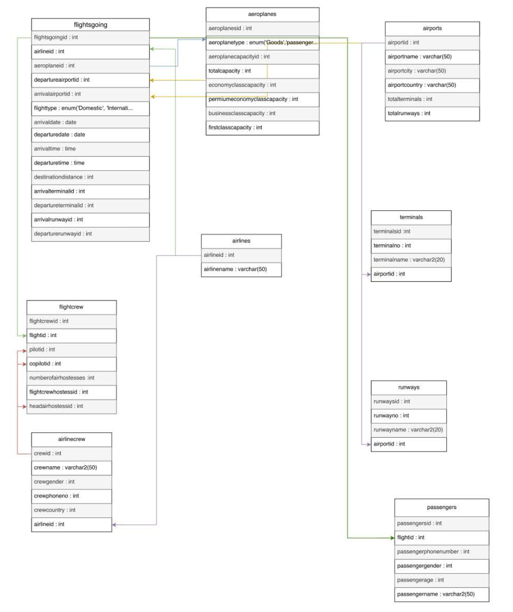
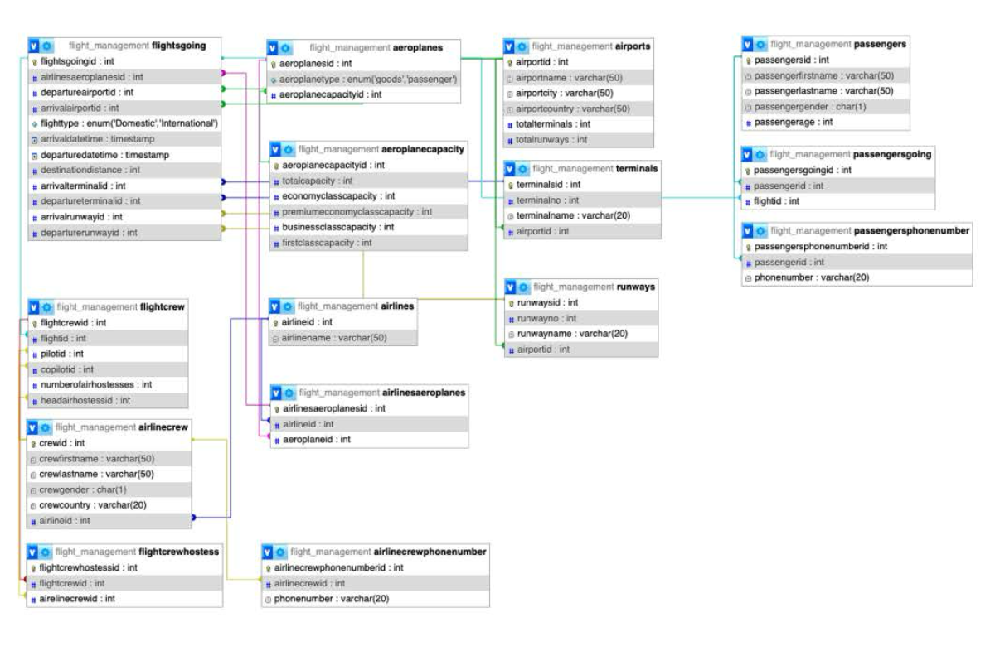
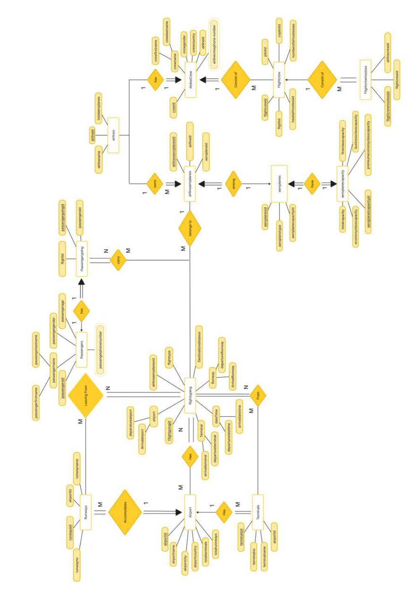

# Flight Management System

The **Flight Management System** primarily deals with the management of flights, flight paths, flight crews, airports, and passengers. The system provides broad overview of underlying operational factors that influence the airport management.  

The database system has the data of all airports and passengers, flights, commercial airports, and passenger scheduling throughout the airline.  

- Airline companies serve multiple flights to multiple destinations in an airport.  
- So the data of flights, the crew, the capacity, the destination and departure locations alongside the passengers are being stored.  
- Every airline is identified by a unique identifier (Airline ID).  
- A flight has a unique airline identification. Airline ID is also printed on the flight ticket and design side of the flight information.  

---

## Airlines Data

Given are 10 examples of Airlines and their IDs — out of 50 Airlines stored in the database:

| Airline Name           | Airline ID |
|-------------------------|------------|
| Singapore Airlines      | 1          |
| Qantas Airways          | 2          |
| Cathay Pacific          | 3          |
| Emirates                | 4          |
| Qatar Airways           | 5          |
| ANA All Nippon Airways  | 6          |
| Lufthansa Airlines      | 7          |
| EVA Air                 | 8          |
| Virgin Atlantic         | 9          |
| Air New Zealand         | 10         |

---

## Airports Data

Given are 10 examples of Airports and their IDs — out of 50 Airports stored in the database:

| Airport Name                          | Airport ID |
|---------------------------------------|------------|
| John F. Kennedy International Airport | 1          |
| Los Angeles International Airport     | 2          |
| Heathrow Airport                      | 3          |
| Narita International Airport          | 4          |
| Sydney Airport                        | 5          |
| Changi Airport                        | 6          |
| Beijing Capital International Airport | 7          |
| Dubai International Airport           | 8          |
| Charles de Gaulle Airport             | 9          |
| Frankfurt Airport                     | 10         |

---

## Flights

- A flight has an arrival time, departure time, a departure and arrival destination, and its duration.  
- Flights have three types of classes:
  - **Business**
  - **Economy**
  - **First Class**
- Flights can be of two types:  
  - **Connecting Flights**  
  - **Non-Stop Flights** (on the basis of destinations and flight paths).  
- Flights can also be of two categories:  
  - **Commercial** (carry passengers from one destination to another)  
  - **Cargo** (only carry cargo, no passengers → passenger data is `NULL`)  

---

## Crew

- An airline consists of multiple crew members whose role is linked to different airplanes.  
- A flight crew consists of:
  - A **pilot**
  - A **co-pilot**
  - A certain number of **flight attendants**, including the chief of the flight attendants.  

---

## Assumptions

- We are not considering privately managed airports. Only publicly owned airports are included.  
- The system is designed only for **international flights**.  
- A city has at most **one international airport**.  
- For connecting flights, flight and airline remain the same at **layover stops**.  

## UML Diagram

---

## Normalized UML Diagram

---

## ER Diagram

---
